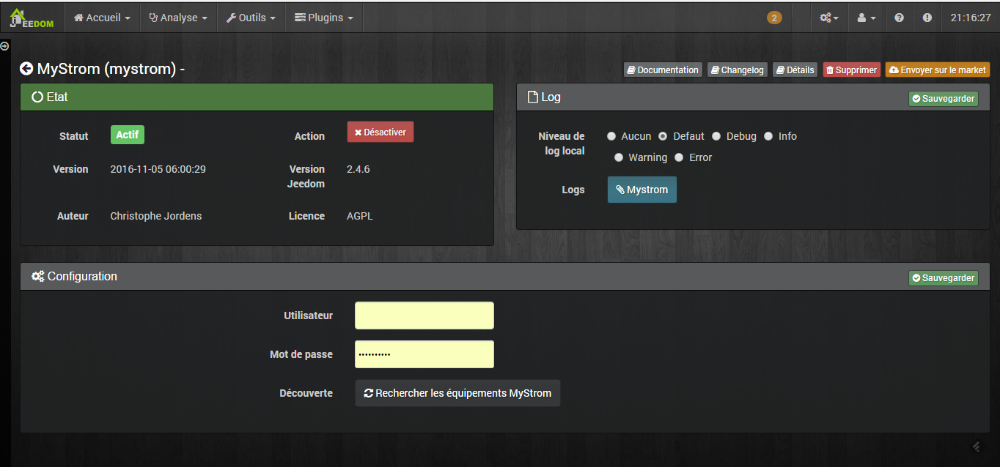
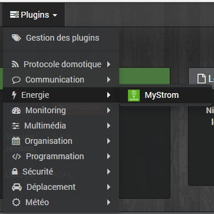
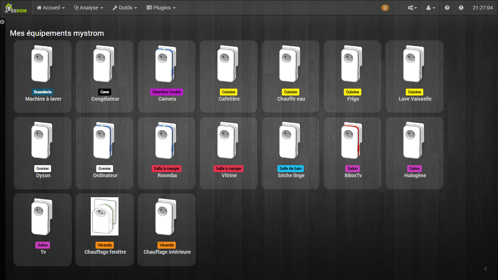
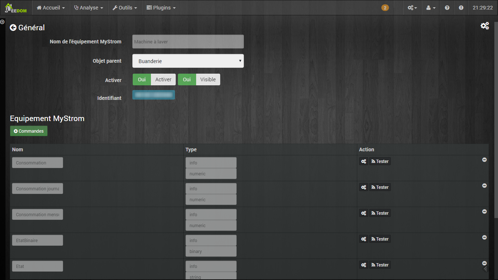

Configuration du plugin
====

Si vous souhaitez gérer vos équipements via le serveur Mystrom, vous devez introduire l'adresse email ainsi que
le mot de passe de votre compte MyStrom.
Ensuite il est très important de sauver avant de continuer!

Cliquez sur le bouton *Rechercher les équipements MyStrom*.

Le plugin créera tous les équipements trouvés sur le serveur Mystrom dans Jeedom.

Configuration des équipements
====
La configuration des équipements MyStrom est accessible à partir du menu
plugin :

Vous y retrouvez la liste des équipements trouvés dans votre compte MyStrom:

Une fois que vous cliquez sur un équipement vous obtenez :

Vous retrouvez ici toute la configuration de votre équipement :

* *Nom de l'équipement MyStrom* : nom de votre équipement dans votre compte
MyStrom.
* *Objet parent* : indique l'objet parent auquel appartient l'équipement.
* *Activer* : permet de rendre votre équipement actif, si un équipement est actif et qu'il est offline 
au moins pendant 1 minute, celui-ci appraîtra dans le centre de message à l'exception des lampes RGB et 
des boutons.
* *Visible* : le rend visible sur le dashboard.
* *Identifiant* : Identifiant de l'équipement sur le serveur MyStrom.

En dessous vous retrouvez la liste des commandes qui diffèrent suivant 
le type d'équipement.






